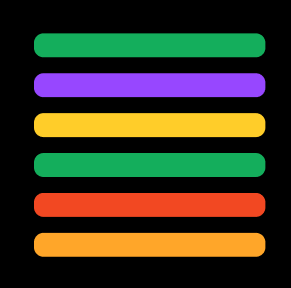

# A Primer to Tracing

> Tokio's Tracing crate guide and explanation

## Introduction
All material will be based on [Tracing version 0.1](https://github.com/tokio-rs/tracing/tree/v0.1.x) and as such all links will refer to pages related to Tracing's version 0.1 . At the time of writing, Tokio version 0.2 is unreleased.

This is a guide and conceptual explaination of Tokio's [Tracing](https://github.com/tokio-rs/tracing/tree/v0.1x) crate and will not be a reference or a tutorial. Please refer to [Tracing's documentation](https://docs.rs/tracing/latest/tracing/) for a reference and more in-depth treatment of the [Tracing](https://github.com/tokio-rs/tracing/v0.1x) crate.

Here is a [disclaimer](#disclaimer) for the present material.


Without further ado, let's start tracing!

## 5 min Quick Start Guide

In a Rust project in a shell of your choosing, add the dependencies

```shell
cargo add tracing tracing-subscriber
```

then in your rust `main` function:

```rust
    fn main() {
        let stdout_subscriber = tracing_subscriber::fmt::new();

        tracing::subscriber::set_global_default(stdout_subscriber);

        tracing::info!("Look ma, I'm tracing!");
    }
```


## Tracing's Sale Pitch

I believe this modified code snippet from a [blog post](https://tokio.rs/blog/2019-08-tracing) posted on the Tokio site about the tracing crate sums up the value of the Tracing crate:

If you normally see logs similar to the following:

```shell
DEBUG server: accepted connection from 106.42.126.8:56975
DEBUG server: closing connection
DEBUG server::http: received request
DEBUG server: accepted connection from 11.103.8.9:49123
DEBUG server::http: received request
DEBUG server: accepted connection from 102.12.37.105:51342
 WARN server::http: invalid request headers
TRACE server: closing connection
```

And you also agree that it is hard to track activaty for any particular IP address then the `tracing` crate can upgrade your logs:

```shell
DEBUG server{client.addr=106.42.126.8:56975}: accepted connection
DEBUG server{client.addr=82.5.70.2:53121}: closing connection
DEBUG server{client.addr=89.56.1.12:55601} request{path="/posts/tracing" method=GET}: received request
DEBUG server{client.addr=111.103.8.9:49123}: accepted connection
DEBUG server{client.addr=106.42.126.8:56975} request{path="/" method=PUT}: received request
DEBUG server{client.addr=113.12.37.105:51342}: accepted connection
 WARN server{client.addr=106.42.126.8:56975} request{path="/" method=PUT}: invalid request headers
TRACE server{client.addr=106.42.126.8:56975} request{path="/" method=PUT}: closing connection
```

This is the special sauce of the `tracing` crate: structured context for logs.

## Fundamental Blocks of Tracing

Let's talk about the `tracing` crate. There are three fundamental concepts to the `tracing` crate: `event`, `level`, `span` and `subscriber`. 
### Log Level

Log levels are very similar to what you will see in other logging libraries. Log levels add simple descriptors to summarize and categorize logs. Log levels are present in logs by appending a description to the logs as shown below with this `debug` log

```shell
DEBUG server::http: received request
```

You may ask why use them and you can find plenty of answers online but here is mine: Without logs it will be difficult to distinguish your logs from another. Take for example the image below. Lets imagine each grey bar represent a specific log and for now ignore any other content.


It is very difficult to identify any subset of logs from this list of logs. Furthermore, if given a task to diagnosis a program there is no way to filter logs that are unrelated to the problem. Now compare the above image with the following image:



Each log line has a color representative of its log level. Now it becomes easier to group related logs.

### Events

Events represent some occurence or some phenomenon happening at some moment in time. Let's say your code finish generating a CSV file, then you might want to record that fact.

```rust
event!(Level::Info, "Finish building CSV; 128k records written into CSV")
```

Notice, how the `event` macro accepts a log level. The log level aids in program diagnosis during benchmarking, debugging or general comprehension. Let's model this event on a timeline representing some given program:


One question to ask is what are the events that led to this event? Said differently, what was going on in the program, or what was the context, when this event was generated? The answer to this could be instrumental to understanding the behavior of a program. This leads us to the concept of spans.

### Spans

Spans represent some period of time, or more practically, some unit of work. They provide context for events for which can describe the conditions for a given event.

Let's see how to create a span in code:

```rust
let span = span!(Level::TRACE, "attempt to save final grades for students");

let guard = span.enter();

for student_id in student_ids {
    save_grade(student_id);
    event!(Level::INFO, "saved grade for student [{student_id}]");
}

drop(guard);
```

Here we created a `span`, entered the `span`, perform some work and generated an event then drop the `span` or *exited* the span.

It's recommended to create spans with the macro `instrument` such as:

```rust
#[instrument]
fn save_grades() {
    event!(Level::TRACE, "attempt to fetch student ids");
    let student_ids = fetch_students();
    event!(Level::INFO, "fetched student ids");

    for student_id in student_ids {
        save_grade(student_id);
        event!(Level::INFO, "saved grade for student [{student_id}]");
    }
}
```

Let's partially model this program to demonstrate the concept of spans:


Each event happens within the context of a span providing information on the conditions for which caused an event to generate and illustrate the overall execution of a program.


At this point, we have covered the fundamental concepts of the `tracing` crate and hopefully have the intuition to use these tools to introduce logging into your project. In the process of using the `tracing`crate, you may run into some problems putting all the required crates together and that is the topic of the next section.

## Publishers and Subscribers

A simplistic view of the `tracing` crate is that it provides a set of publishers. All the macros in the `tracing` crate produce events or spans but there is no code observing the events or spans. So, we need some code to listen to the publishers which is availiable in the `tracing-subscriber` crate.

`tracing-subscriber` provides a basic subscriber which will collect the information from the publishers in the `tracing` crate.

Let see it in action. Run the example `pub-sub`.

At this point, this could be the end of the story. Add the two crates `tracing` and `tracing_subscriber`, select a subscriber and start tracing.

Now, over the course of a project you may encounter a scenario where you want to use features of two different subscribers and if they may happen then let me introduce the `tracing` crate's Regisry.

## Many Layers and just a Registry

Lets create an example where you would like to log tracing data to a file and also generate a flamegraph. From this description you may beleive you just need two subscribers and you are done. Alas, there is no available API to add multiple subscribers. In fact the design of the `tracing` crate restricts projects from having multiple subscribers per thread. The reason being is a subscriber is responsible for assigning unique `span_id`s to spans and thus multiple susbscribers will result in spans having multiple ids which complicate consuming the tracing data. So having a file subscriber and flamegraph subscriber on the same thread is not allowed. However, you still need at least one subscriber on a thread to collect the tracing data. So you want two subscribers but you are limited to only one on a thread. The remedy to this dilemma is to use a registry and some layers.

A registry is a subscriber, provided by the `tracing-subscriber` crate, with the sole purpose to generate span ids for spans and as such be used as the authoritive subscriber for a given thread. However, unlike other subscribers which normally send the tracing data to some medium, the Registry will not send the tracing data anywhere. Lastly, when the Registry receive new events and spans it will notify *Layers* with the newly received events and spans.

Layers are not Subscribers and as such will not assign ids to spans yet they posses much of the same behavior as Subscribers such as reading spans and events and normally they will send the tracing data to some medium. Most importantly, you can multiple Layers active on a given thread since a layer.

Summing up, the Registry will handle span id generation while Layers will read and can write the tracing data, to say, a file or to generate a flamegraph. This brings us back to our opening example and we are finally able to see some code. Run the example `layered`

## Disclaimer
This primer is authored by a non-contributor conmmuntiy member and represent my own thoughts and not contributors, maintainers or authors of the [Tracing](https://github.com/tokio-rs) crate or any relatated crates. 
